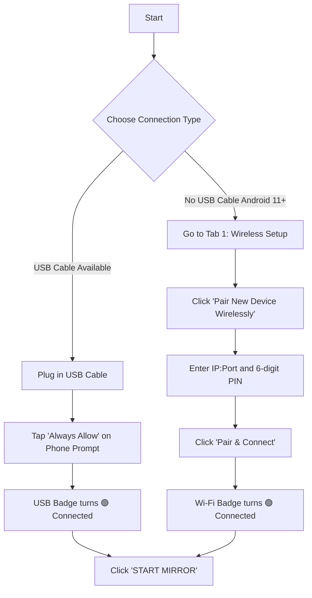

# 📱 SCRCPY PRO CONTROLLER (by Sneak)

<p align="center">
  
</p>

<p align="center">
  <b>A High-Performance, Cyberpunk/Fluent Desktop Suite for Android Device Management & Mirroring.</b>
  <br />
  <i>Powered by PySide6 & Scrcpy Engine v4.1 (Zero External Dependencies Required)</i>
</p>

<p align="center">
  
  
  
  
  
</p>

---

## 🌟 Key Highlights

- ⚡ **Zero-Setup Scrcpy Engine**: Bundled directly with precompiled **Scrcpy v4.1** and Android Platform Tools (`adb`). No command-line installations or path configurations required.
- 🎨 **Modern Fluent / Cyberpunk UI**: High-contrast, sleek interface with seamless **1-Click Dark & Light Theme** switching.
- 📡 **Dual Connection Modes**:
  - **Wired (USB)**: Instant plug-and-play.
  - **Wireless Wi-Fi (No Cables)**: Full Android 11+ Wireless Debugging pair modal (`IP:Port` + 6-digit code), plus 1-click USB-to-WiFi switching for older Android versions.
- 🎮 **1-Click Gaming Preset**: Eliminates buffer lag (`--display-buffer=0`), boosts frame rates up to 120 FPS, optimizes video to H.265, and cuts latency to near-zero.
- 🔋 **Battery-Saver Mirroring**: Physical phone screen can automatically power down (`-S`) while mirroring at full speed on PC.
- 🕹️ **Docked Mini Remote Sidebar**: Real-time magnetic overlay snapped to your mirror screen with 1-click Android navigation buttons (Home, Back, Apps, Volume, Screenshot, Lock).
- 🎥 **Integrated Screen Recording & Camera Mode**: Record gameplay directly to MP4/MKV with instant File Explorer locator, or turn your phone into a high-definition PC webcam.

---

## 🚀 Quick Start Guide

### 1. Download & Install

You have two easy ways to use the application:

#### Option A: Windows Setup Wizard (Recommended)
1. Download or run [`SCRCPY_by_Sneak_Setup_v1.2.exe`](file:///d:/PROJECTS/SCRCPY%20GUI/installer_output/SCRCPY_by_Sneak_Setup_v1.2.exe).
2. Follow the standard installation wizard (select optional Desktop Icon).
3. Launch **SCRCPY by Sneak** directly from your Desktop or Start Menu.

#### Option B: Run from Source
```bash
# Clone the repository
git clone https://github.com/SayanRaut/SCRCPY-by-SR.git
cd "SCRCPY GUI"

# Install dependencies
pip install -r requirements.txt

# Launch the app
python app.py
```

---

## 📲 Step 1: Prepare Your Android Phone (One-Time Setup)

Before connecting for the first time, enable **Developer Options** and **USB Debugging** on your phone:

```
Settings ➔ About Phone ➔ Tap 'Build Number' 7 times (until unlocked)
Settings ➔ System ➔ Developer Options ➔ Turn ON 'USB Debugging'
```

> [!TIP]
> **For Xiaomi / Redmi / POCO users:** Also enable **USB Debugging (Security settings)** to allow keyboard and mouse control.

---

## 🧭 Step 2: How to Connect (Choose Your Method)



### Method 1: Standard USB Cable (Plug & Play)
1. Connect your phone to your PC via a USB cable.
2. When prompted on your phone, tap **"Always allow from this computer"** and tap **Allow**.
3. In the app header, your device will immediately appear in the **Active Target Device** dropdown.
4. Click the large green **▶ START MIRROR** button.

---

### Method 2: 100% Wireless Without Any Cables (Android 11+)
No USB cable required at all:
1. Ensure your phone and PC are connected to the **same Wi-Fi network**.
2. On your phone: Go to **Settings ➔ Developer Options ➔ Wireless Debugging** (turn it ON and tap on it).
3. Tap **"Pair device with pairing code"**. You will see:
   - A **6-digit Wi-Fi pairing code** (e.g., `849201`)
   - An **IP address & port** (e.g., `192.168.1.15:39185`)
4. In the app:
   - Go to **Tab 1: Connection**.
   - In Card A, click **"⚡ Pair New Device Wirelessly (No USB Cable)"**.
   - Enter the IP:Port and the 6-digit code.
   - Click **"Pair & Connect"**.
5. Once paired, the app automatically connects and your phone appears as `🟢 Wi-Fi Online`. Click **START MIRROR**!

---

### Method 3: 1-Click USB to Wi-Fi Switch (Android 10 or Older)
1. Connect phone with USB cable once.
2. In **Tab 1: Connection**, click **"🔌 Switch Connected USB Phone to Wi-Fi"**.
3. Once the app reports `Connected wirelessly!`, **unplug your USB cable**. You are now completely wireless!

---

## 🖥️ User Interface Tour

```
┌────────────────────────────────────────────────────────────────────────┐
│  [Logo] SCRCPY PRO SUITE        [ Active Target Device ▼ ] [🌙 Dark]   │
├────────────────────────────────────────────────────────────────────────┤
│  [ ▶ START MIRROR ]  [ ⏹ STOP ]  [ 🎥 Record & Mirror ] [ 📷 Camera ] │
├────────────────────────────────────────────────────────────────────────┤
│  📁 Output Folder: recordings\               [ 🔍 Locate in Folder ]   │
├────────────────────────────────────────────────────────────────────────┤
│  [ Connection ] [ Display & Quality ] [ Smart Features ] [ Recording ] │
│ ┌────────────────────────────────────────────────────────────────────┐ │
│ │  Card Controls & Configuration Options                             │ │
│ └────────────────────────────────────────────────────────────────────┘ │
├────────────────────────────────────────────────────────────────────────┤
│  Activity Log & ADB Terminal                    [ Clear ] [ Copy ]     │
│  [00:00:01] [INFO] Device connected: 192.168.1.15:5555                │
└────────────────────────────────────────────────────────────────────────┘
```

### 1. Hero Action Bar
- **▶ START MIRROR**: Launches the high-performance Scrcpy mirror session.
- **⏹ STOP**: Safely terminates the active session or force-kills frozen processes.
- **🎥 Record & Mirror**: Mirrors screen and records the session to an MP4 video file simultaneously.
- **📷 Camera Mirror**: Activates high-definition webcam mode using your phone's rear or front camera.

### 2. Tab Navigation
- **🔗 Connection**: Real-time 3D interactive phone canvas showing battery health, charging status, temperature, and quick ADB tools.
- **🎛️ Display & Quality**: 
  - **Bitrate**: Custom streaming rate from 2 Mbps up to 32 Mbps (lossless).
  - **Resolution**: Native, 2K (1440p), Full HD (1080p), 1024p (gaming balanced), 720p, or 480p.
  - **Framerate**: 30 FPS, 60 FPS (Silky), 90 FPS, or 120 FPS (Ultra Gaming).
  - **Video Codec**: H.264, H.265 (High Efficiency), or AV1.
  - **Orientation**: Lock screen to Portrait (0°), Landscape (90°/270°), or Inverted (180°).
- **⚡ Smart Features & Gaming**:
  - **🚀 1-Click Game Preset**: Instantly configures zero-latency settings for competitive gaming.
  - **🔋 Turn Screen Off (`-S`)**: Keeps the physical phone screen dark during mirroring to prevent heat and save battery.
  - **☕ Stay Awake (`-w`)**: Prevents phone from going into sleep mode while connected.
  - **🖱️ Mouse & Keyboard Control**: Toggle PC input injection on or off.
  - **📌 Always on Top**: Keeps mirror window above all other PC apps.
- **🎬 Recording**:
  - Choose between **MP4** or **MKV** container formats.
  - Change default recordings destination directory.
  - Fast **"Open Folder"** and **"Locate in Explorer"** buttons.

---

## ⌨️ Essential Keyboard Shortcuts

While the mirror window is focused, use the following shortcuts:

| Shortcut | Action |
|:---|:---|
| `Alt` + `f` | Toggle Fullscreen Mode |
| `Alt` + `h` | Press Home Button |
| `Alt` + `b` / `BackSpace` | Press Back Button |
| `Alt` + `s` | Open App Switcher (Recent Apps) |
| `Alt` + `p` | Turn Phone Screen ON / OFF |
| `Alt` + `o` | Turn Physical Device Screen Off (Keep Mirroring) |
| `Alt` + `Up` / `Down` | Volume Up / Volume Down |
| `Alt` + `Shift` + `s` | Capture Screenshot to PC |
| `Ctrl` + `c` | Copy Device Clipboard to PC |
| `Ctrl` + `v` | Paste PC Clipboard into Device |

---

## 🛠️ Building & Packaging

To compile a new standalone build and generate the installer:

```powershell
python build_exe.py
```

This single command will:
1. Run PyInstaller in `--onedir` mode with customized assets.
2. Bundle the Scrcpy v4.1 engine and platform tools.
3. Automatically invoke **Inno Setup (ISCC)** to compile `SCRCPY_by_Sneak_Setup_v1.2.exe` into `installer_output/`.

---

## ❓ Troubleshooting

<details>
<summary><b>Device is not recognized ("No Device Connected")</b></summary>

1. Ensure USB Debugging is turned **ON** in Developer Options.
2. Change USB connection mode on your phone from *"Charging Only"* to *"File Transfer (MTP)"*.
3. Try unplugging and re-plugging the cable.
4. Click **"Restart ADB Server"** in Tab 1.
</details>

<details>
<summary><b>Wireless pairing timeout or connection failed</b></summary>

1. Verify both your PC and phone are on the **exact same Wi-Fi router / frequency**.
2. Note that the port on the pairing dialog changes every time you open the "Pair device" dialog on Android. Always use the active port shown on your phone screen.
</details>

<details>
<summary><b>Audio not playing through PC speakers</b></summary>

- Audio forwarding requires **Android 11 or higher**. On Android 10 or older, video will mirror smoothly while audio plays through the phone speaker.
- Ensure *"Disable Audio Forwarding"* in Tab 3 is unchecked.
</details>

---

## 📄 License & Credits

- Built with ❤️ by **[Sayan Raut (Sneak)](https://github.com/SayanRaut)**.
- Scrcpy Engine developed by [Genymobile](https://github.com/Genymobile/scrcpy) (Apache License 2.0).
- GUI Framework powered by [PySide6](https://pypi.org/project/PySide6/) and [QtAwesome](https://github.com/spyder-ide/qtawesome).
- Released under the [MIT License](LICENSE).
